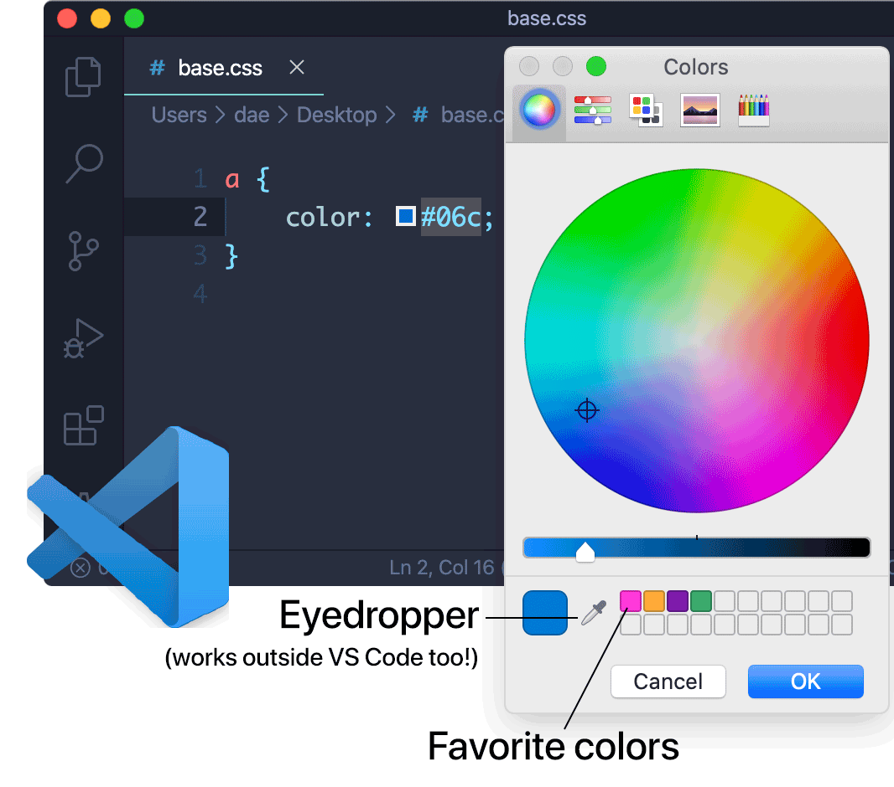
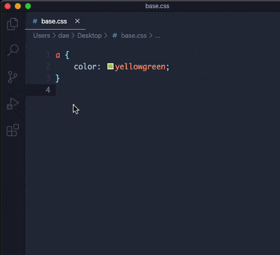

# macOS Color Picker (VS Code extension)



A Visual Studio Code extension that brings native macOS color picker. Supports various CSS3 color notations. Works like the “Insert Color” action in TextMate.

**Sorry, the extension does not work on Windows or Linux.**

## Why native color picker?

1. Works very fast because it’s built-in into macOS.
2. The eyedropper can also be used outside VS Code.
3. Keeps favorite colors, which can be reused in other applications.
4. Lots of modes (HSB, web-safe colors etc) and other useful stuff.

## Installation

[Click **Install** on the Marketplace](https://marketplace.visualstudio.com/items?itemName=dae.vscode-mac-color-picker), or run in the command palette (Cmd-Shift-P):

```
ext install dae.mac-color-picker
```

## Usage

Run `Open macOS Color Picker` in the command palette (Cmd-Shift-P) to launch the color picker. **It is highly recommended to configure a keybinding, such as Cmd-Shift-C ([see how to do this](res/keybinding-how-to.gif))**.

<p align="center"></p>

If a color is selected, the extension will pass it into the color picker. The following notations are supported:
- CSS keywords, for example: `transparent`, `black`, `red` (but not `currentcolor`).
- 6 digit hex codes, for example: `#FFF`, `#563D7C`.
- 8 digit hex codes, for example: `#563D7CAB` *(see note below)*.
- rgb() / rgba() notations, for example:
    - `rgb(255, 255, 255)`
    - `rgba(255, 255, 255, 0.5)` *(see note below)*
- hsl() / hsla() notations, for example:
    - `hsl(360, 100%, 50%)`
    - `hsla(360, 100%, 50%, 0.5)` *(see note below)*
- hwb() notation, for example: `hwb(60, 3%, 60%)`

**Note:** the color picker currently cannot change the alpha channel value (opacity). This may change in the future releases.

## Settings

```javascript
{
    "macColorPicker.defaultColorNotation": "hex", // Which notation to use when inserting (rather than updating) a color
    "macColorPicker.lowercaseHexColors": true, // Output hex colors in lowercase, e.g.: `#fff` instead of `#FFF`
    "macColorPicker.shortHexColors": true // Shorten hex colors when possible, e.g.: `#777` instead of `#777777`
}
```

## Feedback

If you have a problem or a suggestion, please open an issue on [GitHub](https://github.com/EugeneDae/vscode-mac-color-picker/issues).

## Special thanks

- Nathan Rajlich ([@TooTallNate](https://github.com/TooTallNate)) for [node-applescript](https://github.com/TooTallNate/node-applescript).
- Josh Junon ([@Qix-](https://github.com/Qix-)) for [color-string](https://github.com/Qix-/color-string) and [color-convert](https://github.com/Qix-/color-convert).
- Dustin Specker ([@dustinspecker](https://github.com/dustinspecker/)) for [shorten-css-hex](https://github.com/dustinspecker/shorten-css-hex).

## License

MIT License © Eugene ‘Dae’ Zuyev (dae@dae.me).
